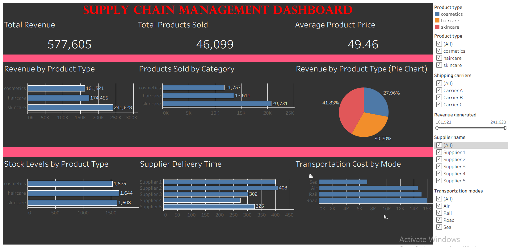

## SUPLY CHAIN MANAGEMENT

## Project Overview
This project focuses on analyzing supply chain data using Tableau. The dashboard provides insights into product sales, inventory levels, 
supplier performance, and transportation costs.

## Tools Used
* Tableau Desktop
* Excel / CSV

## Dataset
The dataset includes information about product types, revenue, stock levels, supplier details, and transportation costs.

## Key Features
* KPI Metrics (Total Revenue, Total Products Sold, Average Price)
* Revenue by Product Type (Pie Chart)
* Products Sold Analysis
* Stock Level Analysis
* Supplier Performance
* Transportation Cost Analysis
* Interactive Filters

## Key Insights
* Skincare products generate the highest revenue.
* Haircare products are the second highest in sales.
* Stock levels are highest for skincare products.
* Supplier delivery time varies across suppliers.
* Road transportation has the highest cost.

## Dashboard Preview

## Project Files

* Tableau Workbook (.twbx)
* Dataset (.csv)
* Project Report (PDF)
